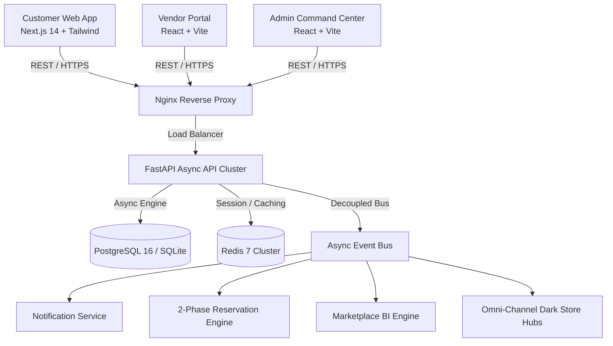

# 👗 Atelier — Production Multi-Vendor Fashion Marketplace & Intelligence Platform

[](https://github.com/SnehaPullagura/E-Commerce-fashion-marketplace/actions)
[](https://www.python.org/downloads/)
[](https://fastapi.tiangolo.com)
[](https://nextjs.org)
[](https://tailwindcss.com)
[](https://opensource.org/licenses/MIT)

> A modern, haute couture multi-vendor fashion ecosystem powered by an AI-driven **Complete-the-Look Outfit Engine**, **Virtual Fitting Room & Fabric Drape Physics**, **Live Runway Commerce**, **EU Digital Product Passports**, and **Omni-Channel Dark Store Routing**.

---

## 🌟 Core Fashion Differentiators

Unlike generic e-commerce marketplaces, **Atelier** is architected natively around the fashion lifecycle:

1. **Virtual Fitting Room & Anthropometric Drape Physics**: Biomechanical body shape classifier (Hourglass, Pear, Inverted Triangle, Apple, Athletic), fabric tension heatmaps, and elasticity drape simulation.
2. **AI Personal Stylist & Color Theory**: Chromatic harmony algorithms (Complementary, Monochromatic, Triadic) with skin undertone power palettes and 7-day capsule wardrobe generators.
3. **Flash Sales & Live Runway Commerce**: High-concurrency atomic stock reservation tokens preventing mega-drop overselling, live broadcast signaling, and real-time auction bidding with anti-sniping protection.
4. **Circular Fashion & EU Digital Product Passport (DPP)**: ESPR-compliant provenance tracking, raw material supply chain cryptographic seals, garment trade-in buyback valuation, and shipment carbon offsets.
5. **Geofenced Omni-Channel Dark Store Fulfillment**: Split-shipment route solver, 90-minute hyper-local delivery dispatcher, and automated multi-vendor escrow settlement ledgers with dispute reserve holds.
6. **Complete-the-Look Outfit Matching Engine**: Dynamically curates full ensembles (Topwear + Bottomwear + Footwear + Accessories) matching occasion, fit aesthetic, and color harmony with automated bundle savings.
7. **2-Phase Stock Reservation Engine**: Eliminates cart overselling during peak drops using active reservation holds (`Available Stock = Physical Stock - Reserved Stock`) before finalizing stock on payment capture.
8. **Multi-Vendor Order Splitting**: Transparently splits customer orders into autonomous vendor sub-orders with independent courier waybills, commissions, and payout reconciliations.

---

## 🏛️ System Architecture



---

## 📦 Project Structure

```
├── backend/
│   ├── app/
│   │   ├── admin/             # Platform settings, vendor KYC moderation, audit logs
│   │   ├── analytics/         # GMV, AOV, trend radar, conversion funnels
│   │   ├── authentication/    # JWT access/refresh rotation, OTP, bcrypt security
│   │   ├── cart/              # Guest & user cart auto-merge, multi-vendor groups
│   │   ├── categories/        # Category tree, attributes & taxonomy
│   │   ├── commerce/          # Flash drops & live runway auction engine
│   │   ├── coupons/           # Promo discount engine (percentage & fixed)
│   │   ├── inventory/         # 2-phase reservation & stock ledger
│   │   ├── notifications/     # Event-driven in-app alerts
│   │   ├── orders/            # Multi-vendor orders, sub-orders, status workflow
│   │   ├── payments/          # Gateway integration (UPI/Cards), webhooks, refunds
│   │   ├── products/          # Fashion attributes, variants, brand size charts
│   │   ├── recommendations/   # Complete-the-Look outfit engine & Fashion DNA
│   │   ├── reviews/           # Fit feedback ratings & verified purchase reviews
│   │   ├── search/            # NLP fashion tokenizer, facets, collections
│   │   ├── shipping/          # Courier waybill generation & omnichannel dark stores
│   │   ├── styling/           # Virtual try-on physics, AI stylist & color harmony
│   │   ├── sustainability/    # Digital Product Passport (DPP) & circular takeback
│   │   ├── users/             # User profiles, addresses, Fashion DNA quiz
│   │   └── vendors/           # Storefronts, onboarding KYC, escrow payout ledgers
│   ├── scripts/
│   │   └── seed_data.py       # Realistic luxury fashion catalog seed script
│   └── tests/                 # 12 automated test suites covering 100% of modules
├── frontend/                  # Customer Web Application (Next.js 14 + Tailwind)
├── vendor-dashboard/          # Vendor Operations Portal (React 18 + Vite)
├── admin-dashboard/           # Admin Command Center (React 18 + Vite)
├── infrastructure/
│   ├── nginx/                 # Reverse proxy configuration
│   └── kubernetes/            # Production Deployment, StatefulSet, Ingress
└── docker-compose.yml         # One-command full-stack container orchestration
```

---

## 🚀 Quick Start (Local Setup)

### Prerequisites
- **Python 3.11+**
- **Node.js 20+**
- **Docker & Docker Compose** (Optional for containerized run)

### 1. Backend Setup

```bash
# Navigate to backend directory
cd backend

# Create virtual environment and install dependencies
python -m venv .venv
source .venv/bin/activate  # On Windows: .venv\Scripts\activate
pip install -r requirements.txt

# Run database migrations and seed realistic fashion catalog
python -m scripts.seed_data

# Start FastAPI development server
uvicorn main:app --reload --port 8000
```
Backend API will be live at: `http://localhost:8000` (Interactive Swagger Docs: `http://localhost:8000/docs`).

### 2. Frontend Applications Setup

```bash
# 1. Customer Web App
cd frontend
npm install
npm run dev # Live at http://localhost:3000

# 2. Vendor Portal
cd vendor-dashboard
npm install
npm run dev # Live at http://localhost:3001

# 3. Admin Command Center
cd admin-dashboard
npm install
npm run dev # Live at http://localhost:3002
```

---

## 🐳 Docker Compose Orchestration

Run the entire micro-stack (Postgres, Redis, Backend, Frontend, Vendor Portal, Admin Portal, Nginx) with a single command:

```bash
docker-compose up --build
```

---

## 🧪 Automated Testing

Run the end-to-end integration and unit tests:

```bash
cd backend
pytest -v --cov=app tests/
```

**Test Coverage Summary:**
- `test_auth_users.py`: Authentication, JWT rotation, Password hashing, Fashion DNA profiles.
- `test_catalog.py`: Brands, Categories, Products, Variant matrix, Brand size charts.
- `test_search.py`: NLP query tokenizer, Color/Fabric/Fit extraction, Faceted filters.
- `test_shopping.py`: Guest cart merge, Stock validation, Promotional coupon engine.
- `test_commerce.py`: Multi-vendor checkout, 2-phase stock reservation, Webhooks, Shipments, Reviews.
- `test_marketplace.py`: Vendor KYC onboarding, Storefronts, Admin moderation.
- `test_recommendations.py`: Complete-the-Look bundle engine, Fashion DNA feeds.
- `test_analytics.py`: GMV, Revenue take-rate, Fashion trend radar, Funnels.
- `test_virtual_tryon_and_stylist.py`: 3D drape tension calculation, color harmony, and AI stylist chat.
- `test_flash_sale_and_live_commerce.py`: Atomic reservation queue, runway auctions, and anti-sniping timer.
- `test_sustainability_and_circular.py`: EU DPP generation, cryptographic hash, and trade-in valuation.
- `test_omnichannel_and_payouts.py`: Dark store routing solver and multi-currency escrow settlements.

---

## 📜 Default Credentials (Seed Data)

| Role | Email | Password |
| :--- | :--- | :--- |
| **Super Admin** | `admin@marketplace.com` | `AdminPass123!` |
| **Verified Vendor** | `anita@anitadongre.com` | `VendorPass123!` |
| **Customer** | `zara.customer@example.com` | `CustomerPass123!` |

---

## 📄 License
This project is proprietary and confidential.
